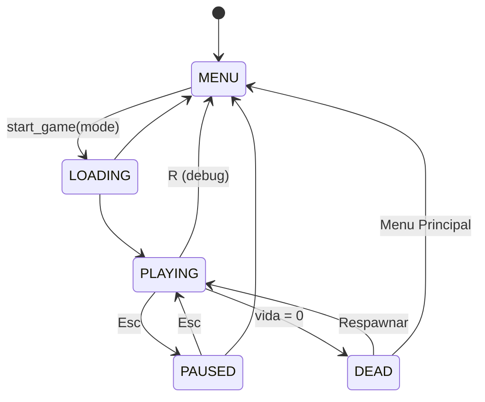

# ARQUITETURA - ᴘᴛ

Este documento descreve como o jogo está organizado: os módulos, como eles se conectam, o fluxo de uma partida e as decisões de projeto por trás do código.
Para instruções de instalação veja o [README](../README.md);
Para padrões de contribuição veja o [CONTRIBUTING](../CONTRIBUTING.md).

## Índice

- [Visão geral](#visão-geral)
- [Inicialização (`main.py`)](#inicialização-mainpy)
- [Máquina de estados](#máquina-de-estados)
- [Modos de jogo](#modos-de-jogo)
- [Mundo e Armazenamento](#mundo-e-armazenamento)
- [Jogador e física](#jogador-e-física)
- [Vida e fome](#vida-e-fome)
- [Ciclo dia/noite](#ciclo-dianoite)
- [Registros: texturas, blocos, itens e entidades](#registros-texturas-blocos-itens-e-entidades)
- [Interface: hotbar, inventário, HUD e menus](#interface-hotbar-inventário-hud-e-menus)
- [Crafting](#crafting)
- [Sons e partículas](#sons-e-partículas)
- [Loop de input](#loop-de-input)
- [Testes e CI](#testes-e-ci)
- [Como estender](#como-estender)
- [Limitações conhecidas e pontos em aberto](#limitações-conhecidas-e-pontos-em-aberto)

## Visão geral

O Pythoncraft é um sandbox voxel em primeira pessoa construído sobre a **[Ursina](https://www.ursinaengine.org)** (que por sua vez usa a **Panda3D**). O terreno é gerado com **perlin-noise**.

A arquitetura segue três ideias principais:

1. **`main.py` é o orquestrador.** Ele cria a aplicação, carrega os registros, instancia a UI uma única vez e reage às trocas de estado da partida. A lógica de jogo propriamente dita fica nos módulos de `game/`.
2. **Lógica pura separada da engine.** Estado da partida (`state.py`), física (`physics.py`), vida/fome (`vitals.py`), ciclo dia/noite (`daynight.py`), regras dos modos (`modes.py`) e receitas (`craft.py`) não dependem de entidades da Ursina e por isso são testáveis com `unittest`. As classes que tocam a engine (`PlayerController`, `DayNightLighting`, `Hotbar`...) apenas aplicam o resultado dessa lógica na cena.
3. **Registros globais por ID.** Blocos, itens, entidades e texturas vivem em dicionários de módulo (`BLOCKS`, `ITEMS`, `ENTITIES`, `textures.blocks`...) indexados por uma string (`"stone"`, `"apple"`). O resto do código só troca IDs; os objetos são obtidos com `get_block`, `get_item`, `get_entity`.

## Inicialização (`main.py`)

A ordem importa, porque a Ursina precisa existir antes de qualquer `Entity` ser criada e os registros dependem das texturas:

1. `os.chdir` para a raiz do projeto — todos os assets são carregados com caminhos relativos (`assets/...`).
2. `app = Ursina()` e só **depois** os imports de `game.*` (vários módulos criam entidades no import, por exemplo `world_parent` em `world.py`).
3. Configuração da janela (`window.*`).
4. Carregamento dos registros, nesta ordem obrigatória:
   `load_all_textures()` → `load_all_items()` → `load_all_entities()` → `load_all_blocks()`.
5. Criação única da UI da partida: crosshair, `Hotbar`, `InventoryScreen`, `HUD` e `DayNightLighting`. Esses objetos são reaproveitados entre partidas e respawns — apenas escondidos/mostrados.
6. Registro dos callbacks da máquina de estados (`game.on_enter(...)` / `game.on_exit(...)`).
7. `ui.build_main_menu(start_game)` e `ui.build_death_screen(_respawn, quit_to_menu)`.
8. `app.run()`. A partir daí a Ursina chama `input(key)` do `main.py` e o `update()` de cada entidade a cada frame.

A flag `--debug` (`python main.py --debug`) liga atalhos de desenvolvimento, como `R` para voltar ao menu.

## Máquina de estados

`game/core/state.py` define o enum `State` e o singleton `game` (`GameState`), que também guarda a partida atual (`game.player`, `game.mode`).



- As transições permitidas estão na tabela `TRANSITIONS`; uma troca inválida levanta `InvalidTransition`.
- `game.change(novo)` chama, nesta ordem: callbacks de **saída** do estado atual (recebem o próximo estado) → atualiza `game.state` → callbacks de **entrada** do novo estado (recebem o estado anterior).
- O comportamento de cada entrada é decidido pelo `main.py` com base no estado anterior. Por exemplo, `_enter_playing` faz coisas diferentes vindo de `LOADING` (cria o jogador), de `DEAD` (recria o jogador no spawn, mantendo o mundo) ou de `PAUSED` (só reativa o jogador e trava o mouse).

| Callback no `main.py` | O que faz |
|---|---|
| `_enter_loading` | esconde o menu, gera o mundo (`create_world(size=28, max_height=8)`), define o spawn, prepara a hotbar do modo e liga o céu às 0.3 (manhã) |
| `_enter_playing` | cria/recria/reativa o jogador conforme o estado anterior; volta a correr o relógio do dia |
| `_enter_paused` | mostra o painel de configurações, desativa o jogador, solta o mouse e congela o tempo |
| `_enter_dead` / `_exit_dead` | mostra/esconde a tela de morte |
| `_enter_menu` | destrói jogador e mundo, esconde a UI da partida e restaura o fundo do menu |

## Modos de jogo

`game/core/modes.py` usa o padrão **Strategy**: o `main.py` e o `PlayerController` nunca perguntam "estou no Survival?"; eles delegam ao objeto `game.mode`.

| Gancho | `GameMode` (base) | `CreativeMode` | `SurvivalMode` |
|---|---|---|---|
| `starting_hotbar` | — | 9 blocos | vazia |
| `block_to_place(hotbar)` | item selecionado, se for bloco | herdado | herdado |
| `on_block_placed(hotbar)` | nada | nada (infinito) | consome 1 do slot |
| `on_block_broken(id, hotbar)` | nada | nada (sem drops) | adiciona `block.drop_id` |
| `tick_vitals` / `apply_damage` | só se `uses_vitals` | desligado | ligado |

Os modos disponíveis ficam em `MODES` e o menu principal cria um botão para cada um automaticamente. A hotbar é tratada por interface ("duck typing"): basta ter `selected_item`, `add_item`, `consume_selected` e `set_items` — é assim que os testes usam um `FakeHotbar`.

## Mundo e Armazenamento

O `game/core/world.py` concentra geração, armazenamento e renderização do terreno.

A fonte da verdade é um único dicionário esparso:

```python
placed_blocks: dict[tuple[int, int, int], str]   # (x, y, z) -> block_id
```

Blocos são cubos 1×1×1 **centrados** na coordenada inteira. Todo o resto (malhas e colisores) é derivado desse dicionário e pode ser reconstruído a partir dele.

| Estrutura | Chave | Conteúdo |
|---|---|---|
| `placed_blocks` | `(x, y, z)` | ID do bloco |
| `_chunk_entities` | `(cx, cz)` | `Entity` pai com as malhas do chunk |
| `_colliders` | `(x, y, z)` | colisor `box` invisível (só para blocos expostos) |
| `world_parent` | — | `Entity` raiz de tudo que pertence ao mundo |

### Geração (`create_world`)

1. **Relevo**: para cada coluna em `[-size, size)`, `get_height` amostra um `PerlinNoise(octaves=4)` e define a superfície. Camadas: `grass` no topo, `dirt` nas 2 abaixo, `stone` até `WORLD_BOTTOM = -3`.
2. **Árvores** (`_generate_trees`): ~5% das colunas de grama, com distância mínima de 8 blocos entre árvores e uma área livre de 3 blocos em volta do spawn. Tronco de `oak_log` (4–6) e copa de `oak_leaves`.
3. **Minérios** (`_generate_ores`): substitui `stone` por `coal_ore`, `iron_ore`, `gold_ore` ou `diamond_ore`, cada um com uma probabilidade e uma profundidade mínima relativa à superfície.
4. **Malhas**: descobre os chunks ocupados e constrói uma malha por chunk.
5. **Colisores**: cria colisores para os blocos expostos.
6. Retorna a altura do topo em `(0, 0)`, usada para posicionar o spawn.

Árvores e minérios usam `random.Random(seed)` derivado da seed do ruído, então a distribuição é reproduzível para um mesmo relevo.

### Renderização por chunk

O mundo é dividido em chunks de `CHUNK_SIZE = 16` blocos em X e Z (sem limite em Y). `_build_chunk_mesh(cx, cz)`:

- percorre os blocos do chunk e, para cada uma das 6 faces, faz **face culling**: a face só é gerada se o vizinho estiver vazio ou for `transparent`;
- agrupa os quads **por textura** — cada textura vira uma `Mesh` própria (uma draw call por textura por chunk, em vez de uma `Entity` por bloco);
- aplica sombreamento fixo por face (`_FACE_SHADE`: topo 1.0, frente/trás 0.8, laterais 0.65, fundo 0.5) via cor de vértice;
- aplica o brilho global do dia/noite (`_light_level`) como cor de cada sub-malha.

### Edição

`break_block(pos)` e `place_block(pos, id)` alteram `placed_blocks` e então:

1. `rebuild_chunk_at(pos)` reconstrói o chunk editado e, se o bloco estiver na borda, o chunk vizinho (`chunks_to_rebuild`), porque a face encostada pode aparecer ou sumir;
2. `_update_colliders_around(pos)` recalcula o colisor da posição e dos 6 vizinhos.

### Colisores e raycast

Os colisores `box` da Ursina **não são usados para a física do jogador** — só para o `raycast` que descobre qual bloco o crosshair aponta. Para economizar, apenas blocos **expostos** (com pelo menos um vizinho vazio, ignorando o "vizinho" abaixo de `WORLD_BOTTOM`) recebem colisor; cavar expõe os blocos de baixo e cria colisores sob demanda.

No `main.py`, o ponto de impacto do raycast é convertido em coordenada de bloco recuando (quebrar) ou avançando (colocar) meio bloco na direção da normal da face atingida.

### Consultas públicas

- `get_block_at(pos)` → ID ou `None`.
- `is_solid_at(pos)` → `True` para blocos `solid` e `interactive`; líquidos e efeitos não bloqueiam o jogador.
- `get_top_y(x, z)` → altura do bloco mais alto da coluna.
- `set_light_level(level)` → atualiza o brilho de todas as malhas (ignora variações menores que 0.005 para não repintar todo frame).
- `clear_world()` → destrói tudo e esvazia os dicionários.

## Jogador e física

### `PlayerController` (`game/core/player.py`)

`Entity` da Ursina com a câmera presa em `camera_pivot` na altura dos olhos. A cada `update()`:

1. `_update_look` — gira o corpo em Y e o pivô da câmera em X (limitado a ±90°) pela velocidade do mouse.
2. `_update_sneak` — Shift agacha (altura 1.5); só levanta se houver espaço acima.
3. `_update_movement` — WASD no plano, pulo com `v = √(2·g·h)` para alcançar `jump_height = 1.25`, gravidade de 32 blocos/s² com velocidade terminal de 60 blocos/s, e resolve colisão com `move_and_collide`.
4. `_update_camera_height` — interpola suavemente a altura dos olhos ao agachar/levantar.
5. `mode.tick_vitals` — avança a fome; se a vida zerar, chama `on_death` → `on_death_callback` → `game.change(State.DEAD)`.

O passo de física é limitado a `MAX_PHYSICS_DT = 1/30` s para evitar saltos grandes em quedas de FPS; a fome usa o `dt` real.

Ao ser desativado (inventário, pausa, morte) o jogador solta o mouse e desacopla a câmera; ao ser reativado ele a reacopla. `unstuck()` sobe o jogador até sair de dentro de blocos (usado no spawn).

### Física (`game/core/physics.py`)

Colisão estilo Minecraft, sem usar os colisores da engine:

- O jogador é uma **AABB** de 0.6 × 1.8 × 0.6 (1.5 agachado), com os **pés** em `position`.
- `overlapping_blocks` calcula quais coordenadas inteiras tocam a caixa e consulta `is_solid(pos)` — uma função injetada (`is_solid_at` do mundo no jogo, um `set` nos testes).
- `move_and_collide` move **um eixo por vez, na ordem Y → X → Z**; ao colidir, encosta a caixa na face do bloco mais próximo com uma folga (`_SKIN = 1e-4`) e marca o eixo como batido.
- Movimentos grandes são divididos em passos de até `_MAX_STEP = 0.45` para não atravessar blocos (tunneling).
- Com `stop_at_edges=True` (agachado e no chão), `_limit_at_edge` reduz o deslocamento horizontal enquanto ele deixaria o jogador sem chão — o jogador não cai de bordas.
- `block_overlaps_player` impede colocar um bloco dentro do próprio jogador.

## Vida e fome

`game/core/vitals.py` — classe `Vitals`, sem Ursina, avançada por `tick(dt)`:

- 20 de vida e 20 de fome.
- Perde 1 de fome a cada `hunger_decay_interval = 40` s.
- Com fome zerada, sofre `starvation_damage = 1` a cada `starvation_interval = 4` s.
- `damage`, `heal` e `eat` são limitados a `[0, máximo]`.

Os timers acumulam `dt` e usam `while`, então o comportamento não depende do FPS. O modo decide se `tick`/`damage` são aplicados (`uses_vitals`).

## Ciclo dia/noite

Dividido em modelo e apresentação:

- **`game/core/daynight.py` — `DayNightCycle`** (puro): `time_of_day ∈ [0, 1)` (0 = meia-noite, 0.25 = nascer, 0.5 = meio-dia, 0.75 = pôr do sol), dia de 600 s. Deriva `sun_angle`, `sun_height`, `daylight` (smoothstep perto do horizonte), `light_level` (mínimo de 0.22 à noite), `is_night` e `sky_color` (interpola noite → dia e mistura laranja perto do horizonte).
- **`game/graphics/lighting.py` — `DayNightLighting`** (`Entity`): a cada frame avança o ciclo e aplica o resultado — cor da janela e da neblina, neblina linear `(22, 45)` que esconde a borda do mundo, posição do sol e da lua em volta da câmera, e o brilho das malhas através do callback `set_world_light` (que é `world.set_light_level`, injetado pelo `main.py`).

Desabilitar a entidade (`lighting.enabled = False`) congela o tempo — é o que acontece na pausa e no menu.

## Registros: texturas, blocos, itens e entidades

### Texturas (`game/textures.py`)

`load_all_textures()` preenche os dicionários de módulo `blocks`, `items`, `entities`, `gui` e `player`, usando o **nome do arquivo sem `.png`** como chave (`assets/textures/blocks/stone.png` → `textures.blocks["stone"]`). Detalhes:

- `BLOCK_ALIASES` mapeia nomes lógicos para arquivos (`"fire"` → `fire_0`).
- `entities/` é carregado recursivamente.
- `gui/heart.png` é uma sprite sheet recortada com Pillow em contorno/cheio/metade.
- Arquivos ausentes geram um aviso no console e viram `None`, em vez de derrubar o jogo.

Como os outros módulos acessam `textures.blocks[...]` **no momento do registro**, `load_all_textures()` precisa rodar antes de `load_all_blocks()`/`load_all_items()`/`load_all_entities()`. Importe o módulo (`import game.textures as textures`) em vez de `from game.textures import blocks`, pois os dicionários são reatribuídos no carregamento.

### Blocos (`game/blocks.py`)

`Block(name, texture | textures, block_type, hardness, transparent, drop, **attributes)`:

- `textures` = `{"top", "bottom", "side"}` (uma única `texture` preenche as três).
- `block_type`: `solid`, `interactive` (bloqueiam o jogador), `liquid`, `effect` (não bloqueiam).
- `transparent`: não esconde as faces dos vizinhos (vidro, folhas, água).
- `drop`: `DROP_SELF` (padrão), outro ID (`grass` → `dirt`, `stone` → `cobblestone`) ou `None` (vidro, gelo, folhas). A propriedade `drop_id` resolve isso.

`register_block(id, block)` grava em `BLOCKS` e define `block.id`.

### Itens (`game/items.py`)

`Item(name, texture, item_type, **attributes)`, com tipos `tool`, `food`, `block`, `utility`. Atributos livres guardam dados específicos (`hunger=4`, `damage=7`, `durability=1560`). `register_item` recusa IDs duplicados.

### Entidades (`game/entities.py`)

`EntityData` descreve animais (nome, textura, tipo `passive`/`neutral`/`hostile`, vida, velocidade). `ANIMALS` lista vacas, porcos, ovelhas, galinhas e cavalos; `load_all_entities()` troca o nome da textura pelo objeto carregado e registra em `ENTITIES`. Por enquanto são apenas **dados** — ainda não há spawn nem IA.

Blocos e itens compartilham o mesmo espaço de IDs na prática: a hotbar guarda só strings e `get_icon_texture` procura primeiro em `BLOCKS` e depois em `ITEMS`. Evite reutilizar o mesmo ID nos dois registros.

## Interface: hotbar, inventário, HUD e menus

Toda a UI é filha de `camera.ui`. As texturas de GUI são desenhadas em "pixels de textura" convertidos por constantes (`HOTBAR_PIXEL = 0.0036`, `INVENTORY_PIXEL = 0.0045`), o que mantém o visual pixel-perfect e permite posicionar slots pelas coordenadas da própria imagem.

- **`ItemIcon`** (`inventory.py`) — quad com o ícone de um bloco/item e a quantidade no canto.
- **`Hotbar`** — 9 slots, pilhas de até `MAX_STACK = 64`. Fonte da verdade do que o jogador carrega hoje. API: `selected_item`, `stacks`, `set_items`, `add_item` (empilha em slots existentes e depois nos vazios; retorna o excedente), `consume_selected`, `select`, `scroll`.
- **`InventoryScreen`** — tela do inventário de sobrevivência (`survival-inventory.png`, 176×166) com armadura, mão secundária, grade de crafting 2×2 + resultado, 27 slots principais e a linha da hotbar. As posições dos slots estão em pixels da textura. Hoje ela **espelha** a hotbar ao abrir (`sync_hotbar`) e destaca o slot sob o mouse; ainda não há arrastar/soltar.
- **`HUD`** (`hud.py`) — 10 corações e 10 ícones de fome alinhados acima da hotbar, atualizados a cada frame a partir de `player_ref.vitals`. `attach_player` reconecta o HUD ao novo jogador após um respawn; os ícones só aparecem em modos com `uses_vitals`.
- **`ui.py`** — menu principal (um botão por modo em `MODES` + Sair), painel de configurações usado como tela de pausa (conteúdo ainda de exemplo) e tela de morte (Respawnar / Menu Principal). Os callbacks são injetados pelo `main.py`, então `ui.py` não conhece a máquina de estados.

## Crafting

`game/craft.py` define `RECIPES` (padrões 3×3 de IDs ou `None`) e `check_craft(grid)`, que compara a grade célula a célula e retorna o ID do resultado ou `None`. A correspondência é **exata e posicional** (a receita não é deslocada nem espelhada). O módulo ainda não está ligado à `InventoryScreen`; os testes garantem que todo padrão bate consigo mesmo, que não há padrões duplicados e que todos os IDs usados existem nos registros.

## Sons e partículas

- **`game/sounds.py`** — resolve os caminhos em `assets/sounds` no import (avisando se faltar arquivo) e expõe `play_break_block`, `play_place_block`, `play_step`, `play_jump`, `play_hit`, cada um com volume e uma pequena variação aleatória de pitch.
- **`game/graphics/particles.py`** — `Particle` é um quad billboard com velocidade, gravidade opcional e tempo de vida; `spawn_particles` cria um punhado com variação aleatória. Usado ao quebrar blocos.

## Loop de input

A função global `input(key)` do `main.py` é chamada pela Ursina a cada evento:

```
PAUSED   → Esc volta para PLAYING; o resto é ignorado
!PLAYING → ignora
PLAYING:
  Esc         → fecha o inventário, ou pausa
  R (--debug) → volta ao menu
  E           → abre/fecha inventário (PlayerController.handle_input)
  (com inventário aberto, nada abaixo é processado)
  clique esq. → _try_break_block  → world.break_block → mode.on_block_broken → som + partículas
  clique dir. → _try_place_block  → checa sobreposição com o jogador → mode.block_to_place
                                   → world.place_block → mode.on_block_placed → som
  scroll/1-9  → seleção da hotbar
```

O alcance para quebrar/colocar é `REACH = 6` blocos. O movimento contínuo (WASD, espaço, Shift) não passa por `input`: é lido de `held_keys` no `update()` do jogador.

## Testes e CI

Os testes usam `unittest` e cobrem principalmente a lógica pura:

| Arquivo | Cobre |
|---|---|
| `test_state.py` | fluxo completo de estados, transições inválidas, ordem dos callbacks |
| `test_modes.py` | regras de Criativo e Survival com um `FakeHotbar` |
| `test_physics.py` | pouso, tunneling, paredes, vãos de 1 e 2 blocos, teto, agachar e bordas |
| `test_vitals.py` | decaimento da fome, dano periódico por fome, limites |
| `test_world.py` | `is_exposed` e `chunks_to_rebuild` |
| `test_craft.py` | consistência das receitas |
| `test_registry.py` | IDs das receitas registrados e existência dos arquivos de textura referenciados |

Os registros são testados trocando os dicionários de `textures` por `defaultdict(lambda: None)`, então nenhuma textura real é carregada.

O workflow `.github/workflows/tests.yml` roda em Python 3.10 e 3.12: instala `requirements.txt`, verifica a sintaxe com `compileall` e executa `python -m unittest discover tests -v`.

Ao adicionar lógica nova, prefira colocá-la em uma função/classe sem Ursina (como `physics.py` ou `vitals.py`) e deixar a `Entity` só aplicar o resultado — é isso que mantém o projeto testável.

## Como estender

**Novo bloco**
1. Adicione a textura em `assets/textures/blocks/<nome>.png` (ou `_top`/`_side`/`_bottom`).
2. Registre em `load_all_blocks()` com `register_block("<id>", Block(...))`, escolhendo `block_type`, `transparent` e `drop`.
3. Para aparecer no Criativo, inclua o ID em `CreativeMode.starting_hotbar`; para ser gerado no mundo, altere `_block_id_for_layer` ou os geradores em `world.py`.

**Novo item**
1. Textura em `assets/textures/items/<id>.png`.
2. `register_item("<id>", Item(...))` em `load_all_items()`, com os atributos necessários (`hunger`, `damage`...).

**Nova receita** — adicione em `RECIPES` usando apenas IDs registrados; `test_registry.py` e `test_craft.py` validam.

**Novo modo de jogo** — crie uma subclasse de `GameMode`, sobrescreva os ganchos necessários e inclua uma instância em `MODES`. O botão no menu aparece sozinho.

**Novo estado** — adicione ao enum `State`, atualize `TRANSITIONS` e registre os callbacks de entrada/saída no `main.py`.

## Limitações conhecidas e pontos em aberto

Itens que já têm estrutura no código mas ainda não estão completos — úteis para quem procura por onde contribuir:

- **Mundo finito e gerado de uma vez**: `create_world` gera toda a área na entrada da partida; `RENDER_DIST` existe mas ainda não há carregamento de chunks por distância. `get_top_y` percorre todo `placed_blocks`.
- **Sem persistência**: o mundo é descartado ao voltar ao menu.
- **Inventário**: apenas a hotbar guarda itens; a `InventoryScreen` só espelha a hotbar e o crafting (`craft.py`) ainda não está ligado a ela.
- **Blocos**: `hardness` ainda não é usado (quebra instantânea); líquidos não escoam; `crafting_table` é `interactive` mas não abre interface.
- **Itens**: comida (`hunger`) e ferramentas (`damage`, `durability`) ainda não têm efeito; `Vitals.eat` já existe para isso.
- **Entidades**: registradas como dados, mas sem spawn, modelo ou IA.
- **Sons**: `play_step`, `play_jump` e `play_hit` estão prontos, mas ainda não são chamados.
- **Idiomas**: `assets/lang/*.json` existem, mas os textos da UI e os nomes de blocos/itens ainda estão fixos em português no código.
- **Configurações**: o painel de pausa mostra opções de exemplo (volume e sensibilidade ainda não são ajustáveis).

by caiothevisual